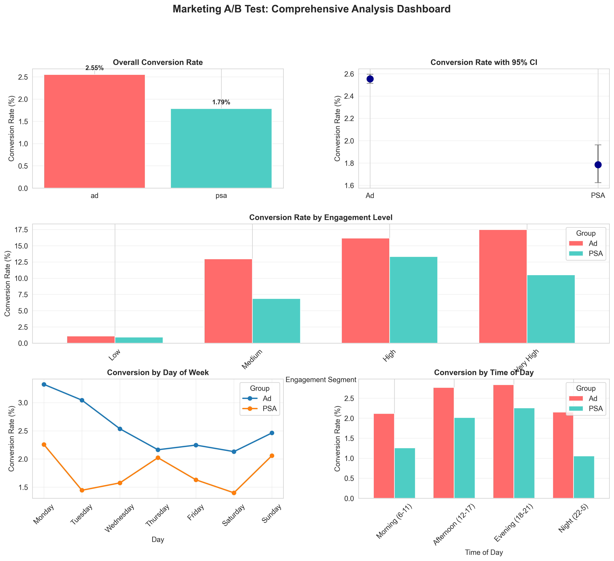
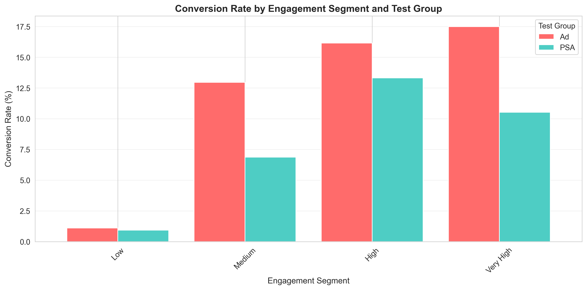

# Marketing A/B Test Analysis: Ad vs PSA Campaign


A comprehensive A/B test analysis evaluating the effectiveness of advertising campaigns versus public service announcements (PSAs) on user conversion rates. This project demonstrates end-to-end experimental design, statistical testing, and business analytics capabilities.

## Project Overview

This analysis examines data from **588,101 users** across two experimental groups to determine whether showing advertisements leads to higher conversion rates compared to public service announcements.

### Key Results
- **42.9% relative increase** in conversion rate for ad group
- **Statistically significant** results (p < 0.001)
- **Large sample size** ensures robust findings
- **Comprehensive segmentation** reveals user behavior patterns

## Business Question

**Does showing advertisements increase conversion rates compared to public service announcements?**

## Project Structure

```
ab-test-marketing/
├── data/
│   ├── raw/                    # Original dataset
│   │   └── marketing_AB.csv
│   └── processed/              # Cleaned and processed data
│       └── marketing_AB_processed.csv
├── notebooks/
│   └── ab_test_analysis.ipynb # Main analysis notebook
├── src/
│   └── utils.py               # Statistical testing utilities
├── reports/
│   ├── executive_summary.md   # Business-focused summary
│   └── test_summary_metrics.json # Key metrics export
├── visualizations/             # All generated plots
│   ├── conversion_rate_comparison.png
│   ├── conversion_by_segment.png
│   ├── conversion_by_day.png
│   ├── conversion_by_hour.png
│   └── comprehensive_dashboard.png
└── README.md
```

## Methodology

### Experiment Design
- **Type:** Two-group randomized controlled trial (RCT)
- **Groups:** 
  - Treatment: Shown advertisements (564,577 users)
  - Control: Shown PSAs (23,524 users)
- **Primary Metric:** Conversion rate
- **Secondary Metrics:** User engagement, temporal patterns

### Statistical Analysis
- **Hypothesis Testing:** Two-proportion z-test, Chi-square test
- **Significance Level:** α = 0.05
- **Confidence Intervals:** Wilson method (95% CI)
- **Effect Size:** Cohen's h
- **Multiple Testing Correction:** Bonferroni correction for segments

### Data Quality Checks
- Sample Ratio Mismatch (SRM) testing
- Duplicate detection
- Missing value analysis
- Randomization validation

## Key Findings

### Overall Performance
| Metric | Ad Group | PSA Group | Lift |
|--------|----------|-----------|------|
| Conversion Rate | 2.55% | 1.79% | **+42.9%** |
| 95% CI | [2.51%, 2.60%] | [1.63%, 1.96%] | - |
| Sample Size | 564,577 | 23,524 | - |

### Statistical Significance
- **P-value:** < 0.001 (highly significant)
- **Effect Size:** 0.18 (small to medium)
- **Conclusion:** Strong evidence that ads improve conversion rates

### Segmentation Insights
1. **Engagement Level:** Higher engagement users show greater ad response
2. **Day of Week:** Conversion patterns vary by weekday vs weekend
3. **Time of Day:** Peak performance during afternoon/evening hours

## Technologies Used

- **Python 3.8+**
- **Data Analysis:** pandas, numpy
- **Statistical Testing:** scipy, statsmodels
- **Visualization:** matplotlib, seaborn
- **Notebook:** Jupyter

## Getting Started

### Prerequisites
```bash
Python 3.8 or higher
pip (Python package manager)
```

### Installation

1. **Clone the repository**
```bash
git clone https://github.com/yourusername/ab-test-marketing.git
cd ab-test-marketing
```

2. **Install dependencies**
```bash
pip install -r requirements.txt
```

3. **Run the analysis**
```bash
jupyter notebook notebooks/ab_test_analysis.ipynb
```

### Dependencies
```
pandas>=1.3.0
numpy>=1.21.0
scipy>=1.7.0
statsmodels>=0.13.0
matplotlib>=3.4.0
seaborn>=0.11.0
jupyter>=1.0.0
```

## Visualizations

### Conversion Rate Comparison


### Comprehensive Dashboard


### Segmentation Analysis


## Usage Examples

### Running Statistical Tests
```python
from src.utils import two_proportion_ztest

# Perform z-test
result = two_proportion_ztest(
    conversions_a=14423,
    total_a=564577,
    conversions_b=420,
    total_b=23524
)

print(f"P-value: {result['p_value']:.6f}")
print(f"Relative Lift: {result['relative_lift']*100:.2f}%")
```

### Calculating Sample Size
```python
from src.utils import calculate_sample_size

# Calculate required sample size
n = calculate_sample_size(
    baseline_rate=0.02,
    mde=0.10,  # 10% relative lift
    alpha=0.05,
    power=0.80
)

print(f"Required sample size per group: {n:,}")
```

## Learning Outcomes

This project demonstrates proficiency in:

1. **Experimental Design**
   - Hypothesis formulation
   - Sample size calculation
   - Power analysis

2. **Statistical Analysis**
   - Hypothesis testing (z-test, chi-square)
   - Confidence interval estimation
   - Effect size calculation
   - Multiple testing corrections

3. **Data Analysis**
   - Exploratory data analysis (EDA)
   - Data cleaning and validation
   - Segmentation analysis

4. **Business Analytics**
   - Translating statistical results to business impact
   - ROI calculation
   - Actionable recommendations

5. **Technical Skills**
   - Python programming
   - Statistical libraries (scipy, statsmodels)
   - Data visualization
   - Version control (Git)

## Checklist for Reproducibility

- [x] Documented experiment design
- [x] Clean, well-commented code
- [x] Statistical assumptions validated
- [x] Multiple visualization types
- [x] Executive summary for stakeholders
- [x] Detailed technical documentation
- [x] Utility functions for reusability
- [x] Clear project structure

## Future Enhancements

- [ ] Add sequential analysis for early stopping
- [ ] Implement Bayesian A/B testing approach
- [ ] Create interactive dashboard with Plotly/Dash
- [ ] Add long-term cohort analysis
- [ ] Include cost-benefit analysis
- [ ] Multi-armed bandit comparison

## References

1. **Statistical Methods**
   - Kohavi, R., & Longbotham, R. (2017). Online Controlled Experiments and A/B Testing
   - VWO A/B Testing Guide: https://vwo.com/ab-testing/

2. **Best Practices**
   - Sample Ratio Mismatch: https://dl.acm.org/doi/10.1145/3292500.3330722
   - Multiple Testing: Bonferroni Correction

3. **Python Libraries**
   - statsmodels documentation: https://www.statsmodels.org/
   - scipy.stats documentation: https://docs.scipy.org/doc/scipy/reference/stats.html

## Author

**[Jordan Shamukiga]**
- Portfolio: [datascienceportfol.io/jordanshamu]

## License

This project is licensed under the MIT License - see the LICENSE file for details.

## Acknowledgments

- Dataset source: [Kaggle Marketing A/B Testing Dataset](https://www.kaggle.com/datasets/faviovaz/marketing-ab-testing)


